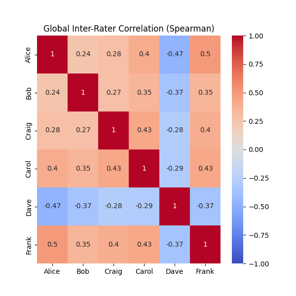

# NIST CSF 2.0 Rater Correlation Analysis

Analyze and visualize inter-rater reliability for NIST CSF 2.0 security assessments using Python

### Why this exists

When assessing security maturity, different managers often have different perceptions. This tool uses Spearman's Rank Correlation to visualize:
* Global Alignment: Do managers generally agree on the security posture?
* Function Drill-down: Are there specific functions (e.g., PROTECT or DETECT) where the team is misaligned?
* Category Drill-down: Are there specific categories (e.g., ID.AM, GV.OV) where the team has different opinions?
* Subcategorty deviation analysis: Are there disagreement within specific details in a category?  

### How to use
1. Clone the repo.
2. Install requirements: pip install -r requirements.txt
3. Replace data/synthetic_ratings.csv with your internal assessment data.
4. Run with python3 analyze_nist_ratings.py 

## Sample Analysis & Interpretation

The following analysis is based on the provided synthetic_nist_ratings.csv dataset.

### Global Alignment (The "Big Picture")

In our synthetic dataset, we observe a Global Spearman Correlation ranging between 0.52 and 1 for most manager pairs.




**Interpretation:** This indicates a certain variance in the organization's security posture. If we exclude the obvious outlier, than we see 
that all information security managers basically have a uniform opinion. This is a sample generated to showcase this, in reality it's never so simple. 
But for the sake of this example, such a uniform correlation would also be a potential bad sign, too much alignment (i.e., tainted results) .

**Outlier Detection:** Dave consistently shows lower correlation (approx 0.52-0.62) with the rest of the group. This suggests Dave may be using a different baseline for "maturity" (e.g., he might be a "strict rater" compared to the group).

### Domain-Specific Friction (Category Breakdown)

When we drill down into specific NIST Functions, distinct patterns emerge:
```
--- Function: Govern (Avg Corr: 0.104) ---
  Category: GV.OC (Avg Corr: 0.220)
  Category: GV.RM (Avg Corr: 0.145)
  Category: GV.RR (Avg Corr: -0.110)
  Category: GV.PO - Not enough data
  Category: GV.OV (Avg Corr: -0.067)
  Category: GV.SC (Avg Corr: 0.105)

  --- Function: Identify (Avg Corr: 0.095) ---
  Category: ID.AM (Avg Corr: -0.053)
  Category: ID.RA (Avg Corr: 0.216)
  Category: ID.IM (Avg Corr: 0.294)

--- Function: Protect (Avg Corr: 0.133) ---
  Category: PR.AA (Avg Corr: 0.138)
  Category: PR.AT - Not enough data
  Category: PR.DS (Avg Corr: 0.038)
  Category: PR.PS (Avg Corr: 0.077)
  Category: PR.IR (Avg Corr: 0.141)

--- Function: Detect (Avg Corr: 0.110) ---
  Category: DE.CM (Avg Corr: 0.035)
  Category: DE.AE (Avg Corr: 0.197)

--- Function: Respond (Avg Corr: 0.172) ---
  Category: RS.MA (Avg Corr: 0.105)
  Category: RS.AN (Avg Corr: 0.583)
  Category: RS.CO - Not enough data
  Category: RS.MI - Not enough data

--- Function: Recover (Avg Corr: 0.109) ---
  Category: RC.RP (Avg Corr: 0.117)
  Category: RC.CO - Not enough data
```

**Highest Agreement in RESPOND (RS):** The correlation is highest in the RESPOND function (> 0.172). Given the synthetic dataset the correlation is extremely low. **In reality this is where an alarm bell should ring!**

### Deep Dive: Category Analysis

The tool also generates correlation matrices for individual NIST Categories (e.g., GV.OC, PR.DS).


**Interpretation:** Global metrics often hide specific operational disagreements. For example, managers might align on Governance overall, but have negative correlation specifically on Supply Chain Risk Management (GV.SC), indicating a specific area where policy definitions are unclear.
In the example above there's general consensus on ID.IM (excluding the synthetic outlier Dave) but the other categories are little aligned. Dave in ID.IM exhibits negative correlation, that indicates that he rated everything **always** lower or higher than the others, which is an indicator that his 
methodology differs from the other manager's.


### Top Disagreements (Actionable Insights)

The script identified the following subcategories with the highest Standard Deviation (σ>2.5):
```
--- Subcategories with High Disagreement (Std Dev > 2.5) [Count: 48] ---
    Category Subcategory  agreement_std
20     GV.OV    GV.OV-03       2.943920
25     GV.SC    GV.SC-05       2.943920
21     GV.SC    GV.SC-01       2.943920
8      GV.RM    GV.RM-04       2.857738
86     RS.MA    RS.MA-02       2.857738
64     PR.PS    PR.PS-01       2.857738
15     GV.RR    GV.RR-04       2.804758
81     DE.AE    DE.AE-04       2.804758
85     RS.MA    RS.MA-01       2.804758
83     DE.AE    DE.AE-07       2.738613
44     ID.RA    ID.RA-07       2.738613
14     GV.RR    GV.RR-03       2.738613
10     GV.RM    GV.RM-06       2.738613
105    RC.CO    RC.CO-04       2.738613
77     DE.CM    DE.CM-06       2.738613
97     RS.MI    RS.MI-02       2.738613
63     PR.DS    PR.DS-11       2.738613
50     ID.IM    ID.IM-03       2.658320
49     ID.IM    ID.IM-02       2.658320
41     ID.RA    ID.RA-04       2.658320
```

Clearly there's some dispute in these subcategories that should be discussed. This can happen if individual managers have a strong opinion or 
use different metrics or measure disparate domains to assess the maturity of a subcategory (leading to high variance).


## How to Read These Results

If you are using this tool for your own organization, use this guide to interpret your correlation coefficients (ρ):

| Spearman ρ  | Interpretation      | Recommended Action                                                                                                                               |
| ----------- | ------------------- | ------------------------------------------------------------------------------------------------------------------------------------------------ |
| 0.80 - 1.00 | Strong Alignment    | No action needed. The team shares a unified view of risk.                                                                                        |
| 0.50 - 0.79 | Moderate Alignment  | Calibration Required. Discuss the specific Categories where the dip occurs.                                                                      |
| < 0.50      | Weak / No Alignment | Urgent Review. The team is fundamentally misaligned. You are likely assessing different scopes or have different definitions of the scale (1-5). |

